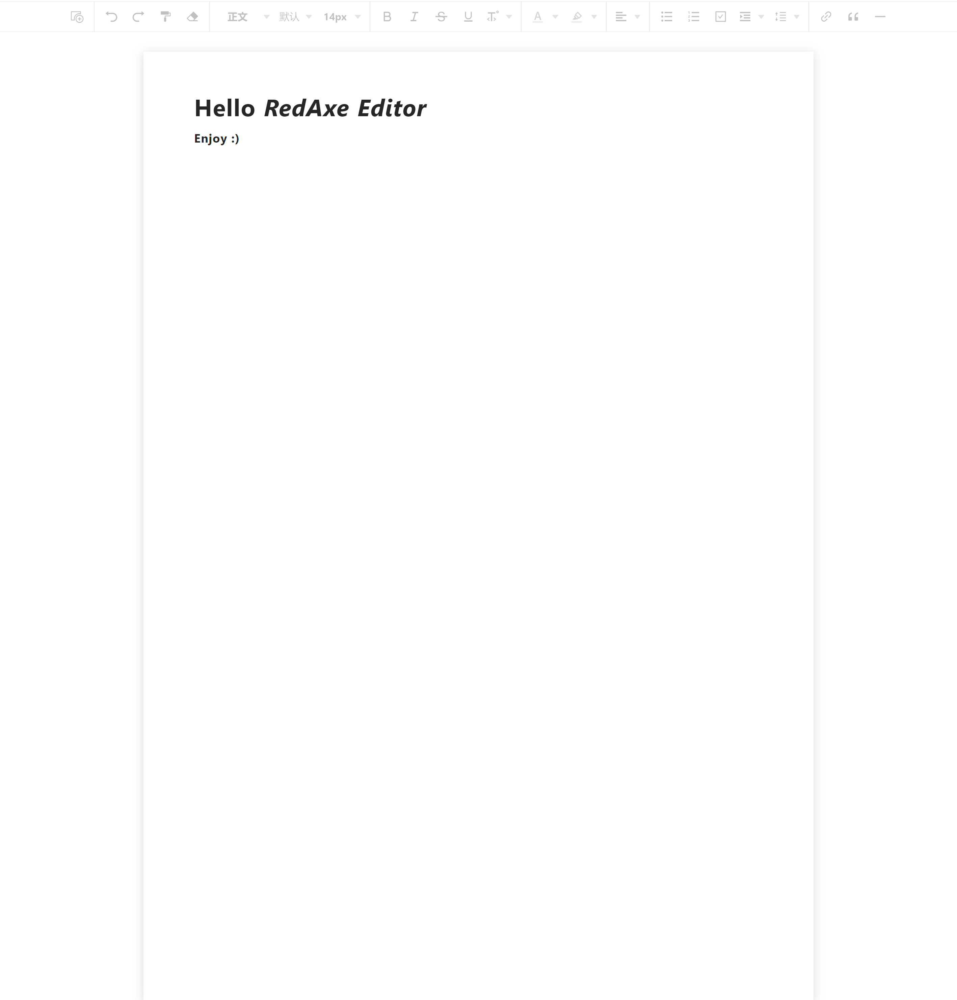

## Modern Vue

[am-editor](https://github.com/red-axe/am-editor) for Vue3.

<p align='center'>
<b>English</b> | <a href="https://github.com/byoungd/am-editor-vue/blob/main/README.zh-CN.md">简体中文</a>
</p>



## Usage

```bash
yarn add am-editor-vue

# or npm
npm i am-editor-vue

# or pnpm
pnpm add am-editor-vue

# or Rush
rush add -p am-editor-vue

```

## Vue

```Vue

<script setup lang="ts" name="OfficeMig">
import { ref } from 'vue'
import Editor, { ChangeInterface, ChangePayload, EditorInstance } from 'am-editor-vue'
import 'editor/dist/style.css'

const editor = ref<EditorInstance | null>(null)
const content = ref('<h1>Hello Editor</h1>')

const style = ref({
  padding: '0',
  background: '#fff',
})

const onChange = ({html, json}: ChangePayload) => {
  console.log('html content: ', html)
  console.log('json content: ', json)
}

</script>

<template>
  <Editor
    ref="editor"
    v-model="content"
    @change="onChange"
    :styleOption="style"
  />
</template>

```

### Development

Install Rush tool kit:

```bash
npm i -g pnpm typescript eslint@7 @microsoft/rush prettier
```

Go project folder and using `rushx` run and visit `http://localhost:3333` :

```bash
rush update

rush rebuild -T editor

cd packages/editor

rushx dev
```

### Build

To build the App, run

```bash
cd apps/example

rushx build
```

With Env:

```bash
rushx build:test
```

And you will see the generated file in `dist` that ready to be served.

## Final

enjoy :)
