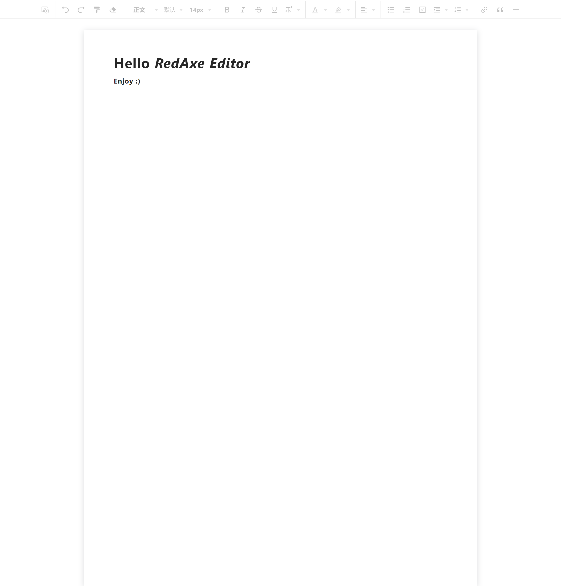

## Modern Vue

Am-editor Vue3 组件。



## 使用方式

```bash
yarn add am-editor-vue

# or npm
npm i am-editor-vue

# or pnpm
pnpm add am-editor-vue

# or Rush
rush add -p am-editor-vue

```

## Vue

```Vue

<script setup lang="ts" name="OfficeMig">
import { ref } from 'vue'
import Editor, { ChangeInterface, ChangePayload, EditorInstance } from 'am-editor-vue'
import 'editor/dist/style.css'

const editor = ref<EditorInstance | null>(null)
const content = ref('<h1>Hello Editor</h1>')

const style = ref({
  padding: '0',
  background: '#fff',
})

const onChange = ({html, json}: ChangePayload) => {
  console.log('html content: ', html)
  console.log('json content: ', json)
}

</script>

<template>
  <Editor
    ref="editor"
    v-model="content"
    @change="onChange"
    :styleOption="style"
  />
</template>

```

### 开发

安装全局依赖:

```bash
npm i -g pnpm typescript eslint@7 @microsoft/rush prettier
```

进入项目目录并使用 `rushx`启动 然后浏览器访问 `http://localhost:3333` :

```bash
rush update

rush rebuild -T editor

cd packages/editor

rushx dev
```

### 打包

打包应用使用如下命令:

```bash
cd apps/example

rushx build
```

With Env:

```bash
rushx build:test
```

## 最后

enjoy :)
